# Storm Prediction System — Technical Blueprint

> **Document Version:** 1.0.0  
> **Generated:** 2026-04-11  
> **Phase Covered:** Phase 1 (Offline ML Pipeline)  
> **Status:** Phase 1 Complete · Phase 2 Planned · Phase 3 Planned

---

## Table of Contents

1. [Project Overview](#1-project-overview)
2. [Tech Stack](#2-tech-stack)
3. [Repository / Folder Structure](#3-repository--folder-structure)
4. [System Architecture](#4-system-architecture)
5. [Backend Design](#5-backend-design)
6. [Frontend Design](#6-frontend-design)
7. [Database Blueprint](#7-database-blueprint)
8. [Entity Relationship and Data Flow Mapping](#8-entity-relationship-and-data-flow-mapping)
9. [API Blueprint](#9-api-blueprint)
10. [Authentication and Authorization](#10-authentication-and-authorization)
11. [Core Business Modules](#11-core-business-modules)
12. [Design Patterns and Code Quality Assessment](#12-design-patterns-and-code-quality-assessment)
13. [Configuration and Environment](#13-configuration-and-environment)
14. [Deployment / Runtime Architecture](#14-deployment--runtime-architecture)
15. [Key End-to-End Flows](#15-key-end-to-end-flows)
16. [Risks, Gaps, and Improvement Opportunities](#16-risks-gaps-and-improvement-opportunities)
17. [Developer Onboarding Guide](#17-developer-onboarding-guide)

---

## 1. Project Overview

### What the System Does

The **Storm Prediction System** is a machine-learning pipeline that ingests atmospheric pressure and temperature sensor readings, engineers meteorological features, trains a binary classifier, and outputs a storm risk prediction for a configurable look-ahead window (default: 3 hours).

The system is purpose-built for a **multi-phase roadmap**:

| Phase | Description | Status |
|-------|-------------|--------|
| **Phase 1** | Offline ML training pipeline + local JSON inference | **Complete** |
| **Phase 2** | ESP32 + BMP280 hardware integration, live HTTP inference | Planned |
| **Phase 3** | BME280 upgrade (humidity), rain/wind sensors, MQTT streaming pipeline | Planned |

### Business / Domain Purpose

The domain is **operational meteorology at the edge**. The end goal is a low-cost, deployable IoT-to-prediction system that:

- Reads atmospheric sensor data from a BMP280/BME280 chip on an ESP32 microcontroller
- Detects barometric signatures of approaching storms 3 hours in advance
- Issues a binary storm alert with a probability score and a risk level (`LOW`, `MEDIUM`, `HIGH`)

The project replaces expensive professional weather station setups with a sub-$10 hardware component backed by a trained XGBoost model.

### Main Actors / Users

| Actor | Role |
|-------|------|
| **Data Scientist / ML Engineer** | Runs the training pipeline, tunes models, evaluates performance |
| **Developer** | Integrates the inference layer with hardware (Phase 2+) or downstream alerting systems |
| **End User (Phase 2+)** | Receives storm probability scores via the ESP32/app interface |
| **ESP32 Microcontroller** | Pushes sensor readings to the inference layer (Phase 2+) |

### Main Modules / Business Areas

1. **Data Ingestion** — load raw CSV or generate synthetic weather data
2. **Preprocessing** — clean, sort, clip, and fill gaps in time-series sensor data
3. **Feature Engineering** — derive lag, delta, and rolling statistical features from raw readings
4. **Label Generation** — create binary storm labels using pressure-drop weak supervision
5. **Model Training** — time-aware XGBoost classifier training with class-imbalance handling
6. **Model Evaluation** — compute Precision, Recall, F1, ROC-AUC, PR-AUC, and select optimal decision threshold
7. **Hyperparameter Tuning** — grid search over XGBoost parameter space
8. **Inference** — rolling-buffer prediction from JSON sensor readings

### High-Level Technical Stack

- **Language:** Python 3.11+
- **ML Framework:** XGBoost, scikit-learn
- **Data Processing:** pandas, numpy
- **Model Serialization:** joblib (`.pkl` format)
- **Configuration:** YAML (`config.yaml`)
- **Testing:** Python `unittest`
- **Runtime Target (Phase 2+):** ESP32 microcontroller → HTTP/MQTT → Python inference server

---

## 2. Tech Stack

| Layer | Technology | Purpose | Where Used |
|-------|------------|---------|------------|
| **Language** | Python 3.11+ | All logic | `src/`, `app/`, `tests/` |
| **ML — Classifier** | XGBoost (`xgboost`) | Primary storm classifier | `src/train.py`, `src/tune.py` |
| **ML — Utilities** | scikit-learn | Metrics, preprocessing utilities | `src/evaluate.py` |
| **Data Manipulation** | pandas | DataFrame operations, time-series resampling | All `src/` modules |
| **Numerical Computing** | numpy | Vectorised array operations, synthetic data generation | `src/data_loader.py` |
| **Model Persistence** | joblib | Serialize/deserialize trained `.pkl` model files | `src/train.py`, `src/predict.py` |
| **Configuration** | PyYAML (`config.yaml`) | Path, threshold, model hyperparameter config | `config.yaml` (read manually per module) |
| **Testing** | Python `unittest` | Unit tests for features, labels, prediction | `tests/` |
| **Environment** | Python `venv` (`Storm-venv/`) | Dependency isolation | Root of project |
| **Data Format — Training** | CSV | Training, processed, and labeled datasets | `data/` |
| **Data Format — Inference** | JSON | Live sensor input / local inference | `sample_input.json`, `app/local_infer.py` |
| **Historical Data** | NOAA StormEvents CSV | Reference storm event records (1950–2020) | `data/StormEvents_*.csv` |
| **Editor / IDE** | VS Code (inferred) | Development environment | Dev only |
| **OS** | Windows 11 / cross-platform | Host platform | Inference + training |

> **Note:** No web framework, database, frontend, or containerization is present in Phase 1. These are planned for Phase 2+ per the architecture roadmap in `docs/storm-predection.md`.

---

## 3. Repository / Folder Structure

```
StormPredection-Code/
│
├── app/                        # Runtime / inference entry points
│   └── local_infer.py          # CLI wrapper: reads JSON, calls predict_from_payload()
│
├── data/                       # All data — raw, processed, historical reference
│   ├── raw/
│   │   └── weather_raw.csv     # Raw synthetic/loaded sensor data (output of data_loader.py)
│   ├── processed/
│   │   ├── weather_clean.csv   # After preprocessing.py
│   │   ├── weather_features.csv# After features.py
│   │   └── weather_labeled.csv # After labels.py — training-ready dataset (17,520 rows)
│   ├── archive.zip             # Likely compressed NOAA data archive
│   └── StormEvents_details-ftp_v1.0_dYYYY_*.csv  # NOAA StormEvents 1950–2020 (reference)
│       StormEvents_fatalities-ftp_v1.0_dYYYY_*.csv
│
├── docs/                       # Specification and design documentation
│   ├── storm-predection.md     # Full Phase 1 spec: data strategy, feature design, architecture
│   ├── MODEL_REQUIREMENTS.md   # ML model constraints, features, output format
│   ├── DATA_SCHEMA.md          # Data format contracts for training and live input
│   ├── ACCEPTANCE_CRITERIA.md  # Pass/fail acceptance checklist per module
│   ├── Task_BreakDown.md       # Ordered implementation tasks for Phase 1
│   └── My_dev_rules.md         # Coding standards, venv rules, forbidden patterns
│
├── models/                     # Persisted model artifacts
│   ├── storm_model.pkl         # Current production model (tuned, 53 KB)
│   ├── storm_model_v1.pkl      # Earlier trained version (81 KB)
│   ├── storm_model_default.pkl # Default baseline model (81 KB)
│   └── model_metadata.json     # Training metadata: features, threshold, metrics
│
├── src/                        # Core Python package (production logic)
│   ├── __init__.py             # Package marker ("Storm prediction package")
│   ├── constants.py            # FEATURE_COLS, REQUIRED_COLUMNS, RISK_THRESHOLDS
│   ├── data_loader.py          # load_data() + generate_synthetic_weather_data()
│   ├── preprocessing.py        # preprocess_data() — clean, sort, clip, resample, fill
│   ├── features.py             # generate_features() — lag, delta, rolling, time features
│   ├── labels.py               # create_labels() — pressure-drop binary labeling
│   ├── train.py                # train() — XGBoost training with time-aware split
│   ├── evaluate.py             # evaluate_model(), select_decision_threshold()
│   ├── predict.py              # StormPredictor class, predict_from_payload()
│   └── tune.py                 # tune_model() — grid search over XGBoost params
│
├── Storm-venv/                 # Python virtual environment (not committed to VCS)
│
├── tests/                      # Unit tests
│   ├── test_features.py        # Tests generate_features() output columns and values
│   ├── test_labels.py          # Tests create_labels() pressure-drop logic
│   └── test_predict.py         # Integration test: full pipeline to predict_from_payload()
│
├── config.yaml                 # Configuration: paths, model params, thresholds
├── requirements.txt            # Minimal dependencies: pandas, numpy, scikit-learn, xgboost, joblib
├── sample_input.json           # Example 6-reading JSON payload for inference testing
└── README.md                   # Quick start guide
```

### Key Relationships Between Folders

- `src/` is the importable package. All modules import from each other via `from src.X import Y`.
- `app/local_infer.py` is the **only** file in `app/` (Phase 1); it is a thin CLI wrapper over `src/predict.py`.
- `data/` contains a linear chain: `raw → clean → features → labeled`.
- `models/` stores artifacts produced by `src/train.py` and `src/tune.py`.
- `tests/` imports directly from `src/`; test_predict.py is a full integration test.
- `docs/` is purely documentation — not imported, but the authoritative source of truth for design decisions.
- NOAA StormEvents CSVs in `data/` are **reference data** covering 1950–2020; they are not currently wired into the training pipeline (the pipeline uses synthetic data or a simple weather CSV).

---

## 4. System Architecture

### Architecture Pattern

The system follows a **linear data pipeline architecture** — a classic ML batch-processing pattern:

- **No web server, no database, no frontend** in Phase 1
- Each `src/` module is a single-responsibility transformation stage
- Modules are stateless functions (except `StormPredictor`, which holds a rolling buffer)
- Execution is CLI-driven: each script is independently runnable with `argparse`
- The `StormPredictor` class introduces minimal state via a `deque` buffer for inference

This is a **modular monolith** in pipeline form — all stages run sequentially, sharing CSV files as the inter-stage transport medium.

### High-Level Architecture Diagram

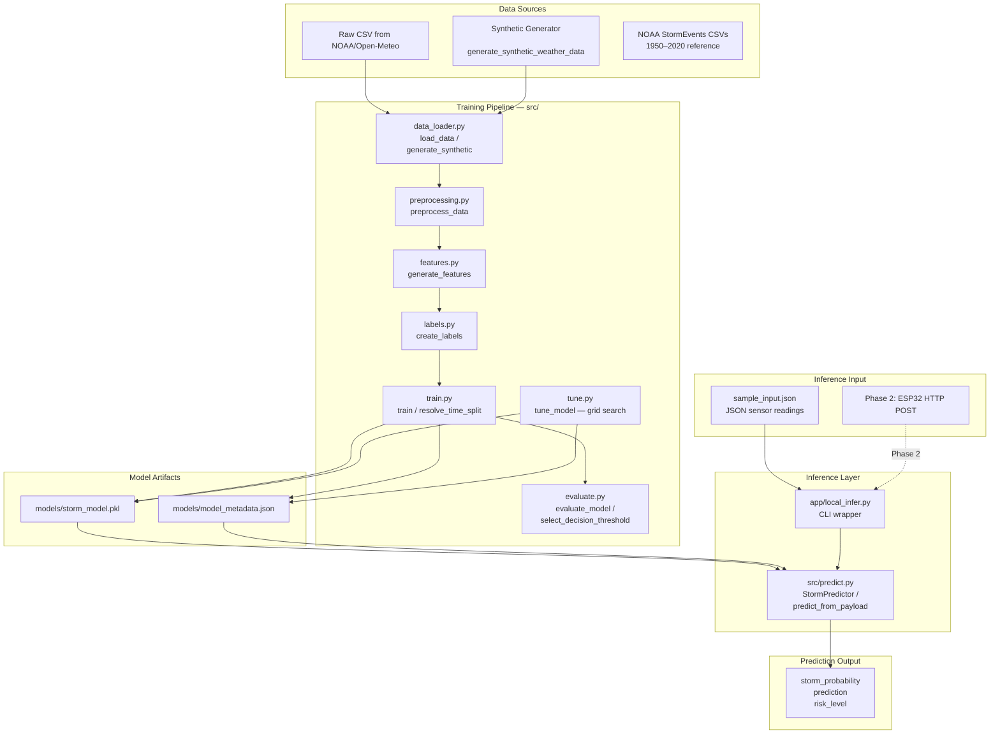

### Layer Descriptions

| Layer | Files | Responsibility |
|-------|-------|----------------|
| Data Ingestion | `src/data_loader.py` | Load CSV or generate synthetic data; validate required columns |
| Preprocessing | `src/preprocessing.py` | Sort, dedup, clip physical bounds, resample to regular frequency, forward-fill gaps |
| Feature Engineering | `src/features.py` | Compute lag, delta, rolling stats, time-of-day features |
| Label Generation | `src/labels.py` | Create binary storm label via pressure-drop rule (or weather codes) |
| Model Training | `src/train.py` | Time-aware split, XGBoost fit with early stopping, save model + metadata |
| Evaluation | `src/evaluate.py` | Compute all metrics, select optimal decision threshold |
| Tuning | `src/tune.py` | Grid search over hyperparameter combinations, select best by recall+F1 |
| Inference | `src/predict.py` | `StormPredictor` rolling-buffer class + `predict_from_payload` function |
| App Entry Point | `app/local_infer.py` | CLI glue: parse args, read JSON, call `predict_from_payload`, print result |
| Shared Constants | `src/constants.py` | `FEATURE_COLS`, `REQUIRED_COLUMNS`, `RISK_THRESHOLDS` |

---

## 5. Backend Design

### Entry Points

All modules are independently executable via `__main__` guard and `argparse`. There is no single application entry point — the pipeline is run stage-by-stage.

| Script | CLI Entry | Key Function |
|--------|-----------|--------------|
| `src/data_loader.py` | `python src/data_loader.py --source synthetic --output data/raw/weather_raw.csv` | `load_data()` / `generate_synthetic_weather_data()` |
| `src/preprocessing.py` | `python src/preprocessing.py --input ... --output ...` | `preprocess_data()` |
| `src/features.py` | `python src/features.py --input ... --output ...` | `generate_features()` |
| `src/labels.py` | `python src/labels.py --input ... --output ... --horizon 3` | `create_labels()` |
| `src/train.py` | `python src/train.py --data ... --output ...` | `train()` |
| `src/evaluate.py` | `python src/evaluate.py --model ... --data ...` | `evaluate_model()` |
| `src/tune.py` | `python src/tune.py --data ... --output ...` | `tune_model()` |
| `app/local_infer.py` | `python app/local_infer.py --model ... --input sample_input.json` | `predict_from_payload()` |

### Module-by-Module Design

#### `src/constants.py`

Central registry of shared constants. Imported by virtually every other module.

```python
FEATURE_COLS = [16 named features]        # Canonical feature vector for model I/O
REQUIRED_COLUMNS = ["timestamp", "pressure_hPa", "temperature_C"]
RISK_THRESHOLDS = {0.8: "HIGH", 0.6: "MEDIUM", 0.3: "LOW"}
```

#### `src/data_loader.py`

Two public functions:

- **`load_data(filepath)`** — reads CSV, validates `REQUIRED_COLUMNS`, parses timestamps, sorts chronologically. Returns a clean `pd.DataFrame`.
- **`generate_synthetic_weather_data(start, periods, freq, seed)`** — creates a 365-day or longer synthetic dataset with:
  - Seasonal + daily temperature sinusoidal waves + noise
  - Pressure with bi-weekly oscillation + noise
  - **Injected storm events**: random pressure drops of up to -4.6 hPa over 6-hour windows — makes the synthetic data realistically trainable

#### `src/preprocessing.py`

**`preprocess_data(df, expected_freq, ffill_limit)`**:

1. Coerces timestamps, sorts chronologically
2. Drops duplicate timestamps (keeps last)
3. Coerces all numeric columns to `float`, with `errors="coerce"` for garbage tolerance
4. **Physical bounds clipping**: pressure 900–1100 hPa, temperature -60–60°C, humidity 0–100%
5. **Resamples to regular frequency** (`asfreq(expected_freq)`) — creates NaN rows for missing timestamps
6. **Forward-fills short gaps** up to `ffill_limit` (default: 2 steps)
7. Drops rows still missing `pressure_hPa` or `temperature_C`

Key design decision: no future information is used in this step (forward-fill only looks backward in time).

#### `src/features.py`

**`generate_features(df)`** — computes all 16 features defined in `FEATURE_COLS`:

| Feature Group | Features | Method |
|---------------|----------|--------|
| Raw | `pressure_hPa`, `temperature_C` | Passthrough |
| Lag | `pressure_lag_1h/2h/3h`, `temp_lag_1h/2h` | `Series.shift(n)` |
| Delta | `pressure_diff_1h`, `pressure_diff_3h`, `temp_diff_1h` | `current - lag` |
| Tendency | `pressure_tendency` | `pressure_diff_3h / 3.0` (hPa/hour) |
| Rolling | `pressure_rolling_mean/std/min_3h`, `temp_rolling_mean_3h` | `rolling(window=3, min_periods=3)` |
| Temporal | `hour_of_day`, `month` | `dt.hour`, `dt.month` |

**Data leakage prevention**: all operations use past-only windows (`shift` with positive values, `rolling` without forward windows).

#### `src/labels.py`

**`create_labels(df, horizon_hours, pressure_drop_threshold, use_weather_code, ...)`**:

Two labeling strategies:

1. **Pressure-drop rule (default)**: Look ahead `horizon_hours` steps, find the minimum future pressure. If `current_pressure - future_min > pressure_drop_threshold (3.0 hPa)`, label = 1.
2. **Weather code rule (optional)**: If a `weather_code` column exists, check if any future step within the horizon matches storm codes [95, 96, 99] (NOAA thunderstorm codes).

**Critical leakage guard**: the last `horizon_hours` rows always get `pd.NA` labels since there is no future data to evaluate against.

#### `src/train.py`

**`train(data_path, model_output, split_date, model_params)`**:

1. Loads labeled CSV, drops NaN rows for all feature + label columns
2. Calls `resolve_time_split()` — uses `split_date` if provided, otherwise 80/20 chronological split
3. Computes `scale_pos_weight = negatives / positives` to handle extreme class imbalance (~96:1 ratio in the current dataset)
4. Instantiates `XGBClassifier` with 300 estimators, max_depth=6, learning_rate=0.05, early stopping on `aucpr`
5. Fits with `eval_set=[(X_val, y_val)]` for early stopping
6. Calls `select_decision_threshold()` to find the best operating threshold on validation probabilities
7. Persists model via `joblib.dump()`, writes `model_metadata.json` alongside

**`resolve_time_split(df, split_date)`** — respects a user-provided timestamp boundary; falls back to 80/20 index-based cut if invalid or not provided. **Never uses random split** (enforced rule).

#### `src/evaluate.py`

**`evaluate_model(model, X, y, threshold)`** — returns a dict with: precision, recall, F1, ROC-AUC, PR-AUC, confusion matrix, and classification report.

**`select_decision_threshold(probabilities, y_true, min_recall=0.15)`** — grid-searches thresholds from 0.10 to 0.90 in 0.05 steps. Scores candidates by: `(meets_recall_target, f1, precision, recall, proximity_to_0.5)`. Returns the best threshold and its metrics.

This two-function pattern decouples metric calculation from threshold selection, making both independently testable.

#### `src/predict.py`

**`StormPredictor` class**:

```
__init__(model_path, buffer_size=12, metadata_path=None)
    → loads model via joblib
    → loads decision_threshold from model_metadata.json (fallback: 0.85)
    → initializes deque(maxlen=buffer_size)

add_reading(reading: dict) → dict
    → appends to buffer
    → if buffer < 4: returns {"status": "buffering"}
    → builds DataFrame from buffer
    → calls generate_features() on buffer frame
    → extracts latest row's features
    → runs model.predict_proba()
    → returns {storm_probability, prediction, risk_level, decision_threshold}
```

**`predict_from_payload(model_path, payload, metadata_path)`** — convenience function: instantiates a fresh `StormPredictor`, feeds all readings in the payload, returns the last result.

**`classify_risk(probability)`** — maps raw probability to `"HIGH"` / `"MEDIUM"` / `"LOW"` using `RISK_THRESHOLDS`.

#### `src/tune.py`

**`tune_model(data_path, model_output, split_date)`** — exhaustive grid search over 1,296 parameter combinations (confirmed in `model_metadata.json`: `"search_candidates": 1296`):

```python
param_grid = {
    "n_estimators":      [200, 350],
    "max_depth":         [2, 3],
    "learning_rate":     [0.03, 0.05],
    "min_child_weight":  [8, 12],
    "gamma":             [1.0, 2.0],
    "subsample":         [0.8],
    "colsample_bytree":  [0.8, 1.0],
    "reg_lambda":        [2.0, 4.0],
}
```

Best model ranked by: `(meets_recall_target, f1, precision, pr_auc, recall)`.

### Error Handling Strategy

| Scenario | Handling |
|----------|----------|
| Missing required columns in CSV | `ValueError` with explicit column list |
| Empty train/val split | `ValueError("Need at least 20 labeled rows")` |
| Missing metadata JSON | Graceful fallback to `DEFAULT_DECISION_THRESHOLD = 0.85` |
| Insufficient buffer for prediction | Returns `{"status": "buffering", "readings": N}` |
| Feature NaN after engineering | `dropna(subset=FEATURE_COLS)` before model call |
| No tuning candidates (edge case) | `RuntimeError("No model candidates were evaluated")` |

### Logging Approach

Phase 1 uses `print()` statements for all operational output (no `logging` module). Each script prints:
- Row counts after each transformation
- Class distribution after labeling
- Metric values after training/evaluation
- Prediction JSON output at inference

**No structured logging, no log files, no log levels.** This is appropriate for a Phase 1 local pipeline but will need to change for Phase 2 server deployment.

### Request Lifecycle (Training)

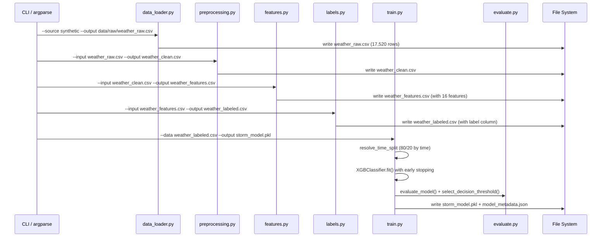

---

## 6. Frontend Design

**Phase 1 has no frontend.**

The system is entirely CLI-driven. All outputs are printed to `stdout` as plain text or JSON.

**Planned (Phase 2/3):**
Per `docs/storm-predection.md` Section 14 (Version 2 Roadmap):
- Real-time **dashboard** for pressure trend visualization and prediction gauge
- **Push notification / email alerting** when storm probability exceeds threshold

A new developer contributing a frontend should note:
- The inference output format is already defined and stable: `{storm_probability, prediction, risk_level}`
- The `StormPredictor` class and `predict_from_payload()` function provide the clean interface to build a web API around
- No authentication or session management exists in Phase 1

---

## 7. Database Blueprint

**Phase 1 uses no database.** All data persistence is through flat CSV files and serialized model files.

### CSV Data Stages

| File | Stage | Columns | Rows (approx.) | Purpose |
|------|-------|---------|-----------------|---------|
| `data/raw/weather_raw.csv` | Stage 0 | `timestamp, temperature_C, pressure_hPa, humidity_pct` | 17,520 | Raw synthetic/loaded data (2 years hourly) |
| `data/processed/weather_clean.csv` | Stage 1 | same as raw | ~17,520 | After preprocessing (sorted, clipped, gap-filled) |
| `data/processed/weather_features.csv` | Stage 2 | raw cols + 16 engineered features | ~17,520 | Feature-engineered dataset |
| `data/processed/weather_labeled.csv` | Stage 3 | feature cols + `label` | 17,520 | Final training dataset; label=0 or 1, last 3 rows label=NA |

### Labeled Dataset Schema (training-ready)

| Column | Type | Description | Constraints |
|--------|------|-------------|-------------|
| `timestamp` | datetime | Hourly timestamp | ISO 8601, unique, sorted |
| `temperature_C` | float | Air temperature | Clipped -60 to 60 |
| `pressure_hPa` | float | Atmospheric pressure | Clipped 900–1100 |
| `humidity_pct` | float | Relative humidity | Optional; clipped 0–100 |
| `pressure_lag_1h` | float | Pressure 1 hour prior | NaN for first row |
| `pressure_lag_2h` | float | Pressure 2 hours prior | NaN for first 2 rows |
| `pressure_lag_3h` | float | Pressure 3 hours prior | NaN for first 3 rows |
| `temp_lag_1h` | float | Temperature 1 hour prior | NaN for first row |
| `temp_lag_2h` | float | Temperature 2 hours prior | NaN for first 2 rows |
| `pressure_diff_1h` | float | Δpressure over 1h | NaN until lag available |
| `pressure_diff_3h` | float | Δpressure over 3h | NaN until lag available |
| `temp_diff_1h` | float | Δtemperature over 1h | NaN until lag available |
| `pressure_tendency` | float | `pressure_diff_3h / 3.0` hPa/h | NaN until lag available |
| `pressure_rolling_mean_3h` | float | Rolling mean pressure 3h | NaN until window full |
| `pressure_rolling_std_3h` | float | Rolling std dev pressure 3h | NaN until window full |
| `pressure_rolling_min_3h` | float | Rolling min pressure 3h | NaN until window full |
| `temp_rolling_mean_3h` | float | Rolling mean temperature 3h | NaN until window full |
| `hour_of_day` | int | 0–23 | Always present |
| `month` | int | 1–12 | Always present |
| `label` | Int64 (nullable) | 0=no storm, 1=storm in next 3h | NA for last 3 rows |

### Model Artifact Schema (`model_metadata.json`)

```json
{
  "model_path": "models/storm_model.pkl",
  "features": ["<16 feature names>"],
  "split_date": "2023-08-07T22:00:00",
  "decision_threshold": 0.7,
  "scale_pos_weight": 95.63,
  "training_params": { "n_estimators": 200, "max_depth": 3, ... },
  "train_rows": 14011,
  "validation_rows": 3503,
  "metrics": { "precision": 0.571, "recall": 0.154, "f1": 0.242, "roc_auc": 0.875, "pr_auc": 0.150 },
  "threshold_selection": { "precision": 0.571, "recall": 0.154, "f1": 0.242, "meets_target": true },
  "tuned": true,
  "search_candidates": 1296
}
```

### Planned Phase 2 Database (SQLite Rolling Buffer)

Per `docs/storm-predection.md`, Phase 2 will introduce a SQLite buffer for storing incoming ESP32 sensor readings in a rolling window:

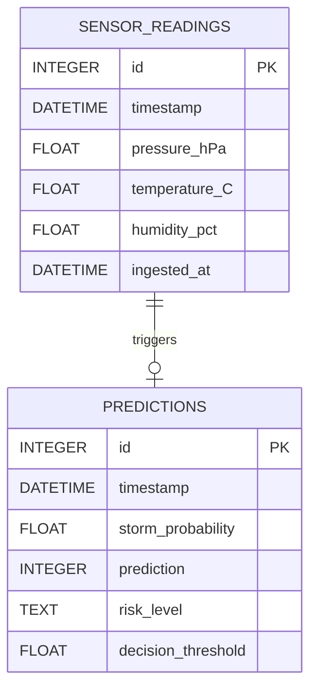

> **Note**: The SQLite schema above is planned/inferred from the architecture doc and does not yet exist in code.

---

## 8. Entity Relationship and Data Flow Mapping

### Generic CRUD-style Data Flow (CSV Stage Progression)

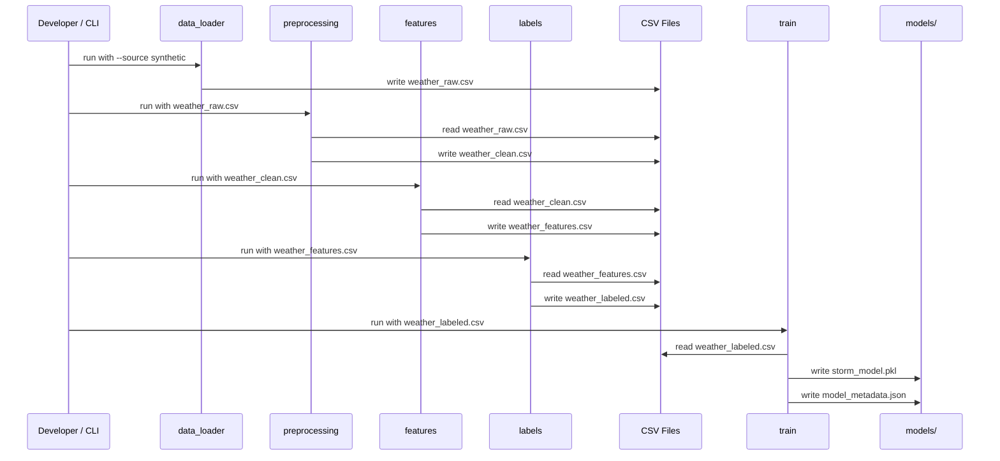

### Core Business Flow — Storm Label Creation

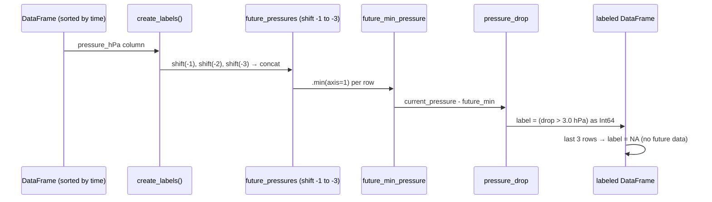

### Inference Flow — Rolling Buffer Prediction

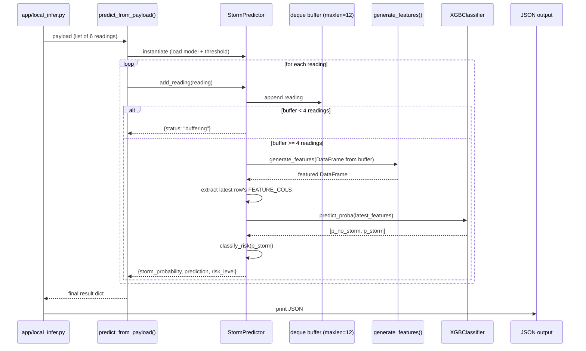

---

## 9. API Blueprint

**Phase 1 has no HTTP API.** All "interfaces" are CLI arguments and JSON file I/O.

### CLI Interface Summary

| Script | Flag | Type | Required | Description |
|--------|------|------|----------|-------------|
| `data_loader.py` | `--source` | `csv\|synthetic` | No (default: `csv`) | Data source |
| `data_loader.py` | `--input` | path | When `--source csv` | Input CSV path |
| `data_loader.py` | `--output` | path | Yes | Output CSV path |
| `data_loader.py` | `--start` | date str | No | Synthetic start date |
| `data_loader.py` | `--periods` | int | No | Synthetic row count |
| `data_loader.py` | `--seed` | int | No | Synthetic RNG seed |
| `preprocessing.py` | `--input` | path | Yes | Raw CSV |
| `preprocessing.py` | `--output` | path | Yes | Clean CSV |
| `preprocessing.py` | `--freq` | str | No (default: `h`) | Time frequency |
| `preprocessing.py` | `--ffill-limit` | int | No (default: `2`) | Max gap to fill |
| `features.py` | `--input` | path | Yes | Clean CSV |
| `features.py` | `--output` | path | Yes | Feature CSV |
| `labels.py` | `--input` | path | Yes | Feature CSV |
| `labels.py` | `--output` | path | Yes | Labeled CSV |
| `labels.py` | `--horizon` | int | No (default: `3`) | Look-ahead hours |
| `labels.py` | `--pressure-drop-threshold` | float | No (default: `3.0`) | hPa threshold |
| `train.py` | `--data` | path | Yes | Labeled CSV |
| `train.py` | `--output` | path | Yes | Model .pkl path |
| `train.py` | `--split` | timestamp | No | Train/val boundary |
| `evaluate.py` | `--model` | path | Yes | .pkl model |
| `evaluate.py` | `--data` | path | Yes | Labeled CSV |
| `evaluate.py` | `--metadata` | path | No | metadata.json |
| `evaluate.py` | `--split` | timestamp | No | Eval split override |
| `tune.py` | `--data` | path | Yes | Labeled CSV |
| `tune.py` | `--output` | path | Yes | Model .pkl path |
| `tune.py` | `--split` | timestamp | No | Train/val boundary |
| `local_infer.py` | `--model` | path | No (default: `models/storm_model.pkl`) | Model .pkl |
| `local_infer.py` | `--metadata` | path | No | metadata.json |
| `local_infer.py` | `--input` | path | Yes | JSON input file |

### Inference Input / Output Contract

**Input** (`--input` JSON file):

```json
[
  {"timestamp": "2023-12-31T18:00:00", "pressure_hPa": 1016.75, "temperature_C": 14.39},
  {"timestamp": "2023-12-31T19:00:00", "pressure_hPa": 1016.21, "temperature_C": 16.21},
  {"timestamp": "2023-12-31T20:00:00", "pressure_hPa": 1017.75, "temperature_C": 14.60},
  {"timestamp": "2023-12-31T21:00:00", "pressure_hPa": 1016.83, "temperature_C": 15.70},
  {"timestamp": "2023-12-31T22:00:00", "pressure_hPa": 1016.72, "temperature_C": 15.71},
  {"timestamp": "2023-12-31T23:00:00", "pressure_hPa": 1017.26, "temperature_C": 16.35}
]
```

**Output** (JSON to stdout):

```json
{
  "storm_probability": 0.0312,
  "prediction": 0,
  "risk_level": "LOW",
  "decision_threshold": 0.70
}
```

Or when buffer is insufficient:

```json
{
  "status": "buffering",
  "readings": 3
}
```

### Planned Phase 2 HTTP API

Per `docs/storm-predection.md`, the Phase 2 app layer will expose:

| Method | Endpoint | Purpose | Auth |
|--------|----------|---------|------|
| `POST` | `/reading` | Accept ESP32 JSON sensor reading, return prediction | None (local network) |
| `GET` | `/status` | Return current buffer state and latest prediction | None |
| `GET` | `/history` | Return recent N readings from SQLite buffer | None |

> **Assumption**: These endpoints are planned; no implementation code exists yet.

---

## 10. Authentication and Authorization

**Phase 1 has no authentication or authorization.** The system is a local pipeline tool.

**Phase 2 Considerations (Planned):**

The `docs/storm-predection.md` describes a local-network deployment where the ESP32 communicates with a Python receiver over HTTP. Since this is LAN-only:

- No user authentication is anticipated for Phase 2
- API keys or HMAC signing would be recommended if the HTTP endpoint is exposed beyond localhost
- The inference server should bind to `127.0.0.1` or `192.168.x.x` (LAN) only, never `0.0.0.0`

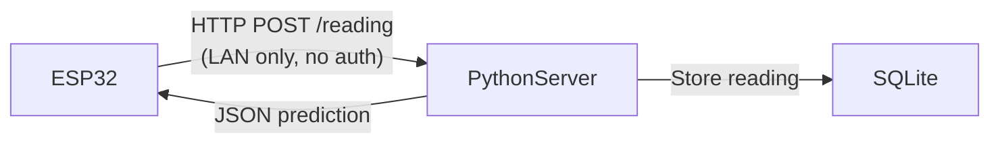

> **Security note for Phase 2**: Input validation of sensor readings must be enforced server-side; a malformed payload with extreme values could mislead the model. The `preprocessing.py` clipping logic (`clip(lower=900, upper=1100)`) should be applied at the API boundary, not just in the training pipeline.

---

## 11. Core Business Modules

### Module 1: Data Ingestion

| Aspect | Detail |
|--------|--------|
| **Responsibility** | Load raw weather data from CSV or generate realistic synthetic data |
| **Key File** | `src/data_loader.py` |
| **Main Entity** | Raw weather DataFrame (`timestamp`, `pressure_hPa`, `temperature_C`, `humidity_pct`) |
| **Main CLI** | `python src/data_loader.py --source synthetic --output data/raw/weather_raw.csv` |
| **Dependencies** | `src/constants.py` (REQUIRED_COLUMNS) |
| **Risk** | Synthetic data has hardcoded storm injection pattern; real-world data may differ significantly |

The synthetic generator injects `max(periods/240, 10)` storm events with a specific 6-step pressure drop profile `[0, -1.2, -2.8, -4.6, -3.7, -2.0]` hPa. This creates a known, learnable signal but may lead to **overfit to this specific drop signature** when real-world storms have different shapes.

### Module 2: Preprocessing

| Aspect | Detail |
|--------|--------|
| **Responsibility** | Sanitize raw sensor data for ML consumption |
| **Key File** | `src/preprocessing.py` |
| **Main Operation** | Sort → dedup → clip → resample → forward-fill → drop NaN |
| **Key Config** | `ffill_limit=2` (max 2-hour gap tolerated) |
| **Dependencies** | `src/constants.py` |
| **Risk** | `asfreq()` can silently insert many NaN rows if data has irregular gaps; with `ffill_limit=2`, gaps > 2h are dropped |

### Module 3: Feature Engineering

| Aspect | Detail |
|--------|--------|
| **Responsibility** | Convert raw sensor stream into an ML feature vector |
| **Key File** | `src/features.py` |
| **Feature Count** | 16 features (defined in `FEATURE_COLS`) |
| **Key Dependency** | `src/constants.py` (FEATURE_COLS, REQUIRED_COLUMNS) |
| **Meteorological Significance** | `pressure_tendency` (hPa/h) is the single most important storm precursor per operational meteorology |
| **Risk** | `rolling(window=3, min_periods=3)` means the first 3 rows always have NaN rolling features; these are dropped later in `train()` via `dropna()` |

### Module 4: Label Generation

| Aspect | Detail |
|--------|--------|
| **Responsibility** | Create the supervised learning target variable |
| **Key File** | `src/labels.py` |
| **Labeling Rule** | If `pressure_hPa - min(pressure in next 3h) > 3.0 hPa → label = 1` |
| **Alternative** | NOAA weather codes [95, 96, 99] for thunderstorm events |
| **Class Imbalance** | Current dataset: ~1% positive labels (95:1 ratio, per `scale_pos_weight`) |
| **Risk** | Weak supervision via pressure-drop rule may mislabel convective storms (which don't always show sharp barometric drops) |

### Module 5: Model Training

| Aspect | Detail |
|--------|--------|
| **Responsibility** | Train and serialize the storm classifier |
| **Key File** | `src/train.py` |
| **Algorithm** | XGBoost `XGBClassifier` |
| **Split Strategy** | Time-based (no random leakage) |
| **Imbalance Handling** | `scale_pos_weight = negatives/positives ≈ 95.6` |
| **Early Stopping** | 30 rounds on validation `aucpr` |
| **Output** | `storm_model.pkl` + `model_metadata.json` |
| **Current Metrics** | Precision: 0.571, Recall: 0.154, F1: 0.242, ROC-AUC: 0.875 |
| **Risk** | Recall of 15% is well below the target of 80%; the model currently misses most storms |

### Module 6: Model Evaluation

| Aspect | Detail |
|--------|--------|
| **Responsibility** | Compute and report all performance metrics |
| **Key File** | `src/evaluate.py` |
| **Key Functions** | `evaluate_model()`, `select_decision_threshold()` |
| **Threshold Selection** | Scans 0.10–0.90 in 0.05 steps, prefers recall ≥ 0.15 then maximizes F1 |
| **Metrics** | Precision, Recall, F1, ROC-AUC, PR-AUC, Confusion Matrix |

### Module 7: Hyperparameter Tuning

| Aspect | Detail |
|--------|--------|
| **Responsibility** | Grid-search optimal XGBoost hyperparameters |
| **Key File** | `src/tune.py` |
| **Search Space** | 1,296 combinations across 8 hyperparameters |
| **Selection Criterion** | `(meets_recall_target, f1, precision, pr_auc, recall)` — lexicographic |
| **Risk** | No cross-validation; single time-split is used; tuned model may overfit to this specific val window |

### Module 8: Inference

| Aspect | Detail |
|--------|--------|
| **Responsibility** | Predict storm probability from a rolling buffer of sensor readings |
| **Key Files** | `src/predict.py`, `app/local_infer.py` |
| **Buffer Size** | Default 12 readings (configurable) |
| **Minimum Buffer** | 4 readings required before any prediction is issued |
| **State** | `StormPredictor` holds a `deque` — stateful between calls |
| **Output Format** | `{storm_probability, prediction, risk_level, decision_threshold}` |
| **ESP32 Compatibility** | JSON input format is the exact Phase 2 sensor payload format |

---

## 12. Design Patterns and Code Quality Assessment

### Patterns Used

| Pattern | Where Used | Notes |
|---------|------------|-------|
| **Pipeline / Chain of Responsibility** | `data_loader → preprocessing → features → labels → train → evaluate` | Each stage is a pure function consuming a DataFrame and producing one |
| **Strategy Pattern (implicit)** | `create_labels(use_weather_code=True/False)` | Two interchangeable labeling strategies behind one function signature |
| **Factory Function** | `predict_from_payload()` | Creates a fresh `StormPredictor` instance and manages its lifecycle |
| **State Machine (minimal)** | `StormPredictor.add_reading()` | Returns `{"status": "buffering"}` vs. prediction dict based on buffer fill level |
| **Shared Constants Module** | `src/constants.py` | Single source of truth for feature names and thresholds |
| **CLI Adapter** | Every `main()` + `argparse` block | Separates function logic from invocation; functions are importable without side effects |
| **Template Method (implicit)** | `train.py` reuses `resolve_time_split()` also imported by `tune.py` | Shared split logic extracted to avoid duplication |

### Strengths

1. **Pure functions throughout**: Every module function (except `StormPredictor`) takes a DataFrame and returns a DataFrame — highly testable and composable.
2. **No data leakage**: Time-based split is strictly enforced; shift operations only use past data; rolling windows use `min_periods=3` and no forward windows.
3. **Constants centralization**: `FEATURE_COLS` in `constants.py` is the single authority on feature names, preventing the common bug where training and inference use different feature sets.
4. **Metadata-driven inference**: The `model_metadata.json` carries the training-time decision threshold, ensuring inference uses the same threshold that was selected during training.
5. **Graceful buffer handling**: `StormPredictor` returns structured status dicts during buffer warmup rather than crashing.
6. **Two model versioning tracks**: `storm_model.pkl` (tuned, 53 KB), `storm_model_default.pkl` and `storm_model_v1.pkl` (81 KB each) — the tuned model is significantly smaller.

### Weak Points

1. **Recall is critically low (15.4% vs. 80% target)**: The domain requirement is to not miss storms, but the model achieves less than 1/5 of the recall target. This is the most important technical gap.
2. **No cross-validation**: A single train/val split means the model selection in `tune.py` is sensitive to the specific split boundary (`2023-08-07T22:00:00`).
3. **Synthetic-only training data**: The pipeline runs on synthetic data by default. The NOAA StormEvents CSVs in `data/` are present but not wired into the training pipeline.
4. **No `config.yaml` integration in code**: `config.yaml` defines paths and thresholds, but none of the `src/` modules actually read it — all use `argparse` defaults instead. The config file is effectively disconnected from the runtime.
5. **Grid search exhaustiveness vs. efficiency**: `tune.py` does 1,296 full model fits with no pruning or early termination of bad candidates. For larger datasets this will be prohibitively slow.
6. **Print-only logging**: No structured logs, no log levels, no file output — will not scale to Phase 2 server deployment.
7. **`StormPredictor` is not serializable**: The buffer state lives in memory; no persistence across process restarts in Phase 2.
8. **No input validation in `StormPredictor.add_reading()`**: A malformed reading (missing keys, wrong types) will raise an unhelpful exception deep in pandas.

### Tight Coupling Areas

- `src/train.py` imports `evaluate.py` at module level — these two concerns are coupled at the import level even though training and standalone evaluation are separate CLI operations.
- `src/predict.py` calls `generate_features()` directly — inference depends on the exact same feature engineering as training. This is intentional but means changes to `features.py` immediately break inference.

### Scalability Concerns

- CSV-based inter-stage transport: fine for Phase 1 (17,520 rows), will not scale to streaming or high-frequency data in Phase 3.
- In-memory `deque` buffer: appropriate for a single ESP32 device; will not work for multiple concurrent sensor streams.
- Grid search without distributed computing: 1,296 × full XGBoost fit is already non-trivial; a larger param grid will require parallelization (e.g., `n_jobs` in a ray/joblib parallel backend).

### Testability Assessment

| Area | Status | Notes |
|------|--------|-------|
| `generate_features()` | Well tested | `test_features.py` checks all 16 columns + value correctness |
| `create_labels()` | Well tested | `test_labels.py` checks pressure-drop logic and NA boundary |
| `predict_from_payload()` | Integration tested | `test_predict.py` runs full pipeline end-to-end |
| `preprocess_data()` | Not tested | No unit test exists |
| `evaluate_model()` | Not tested | No unit test exists |
| `select_decision_threshold()` | Not tested | No unit test exists |
| `tune_model()` | Not tested | No unit test exists |
| `train()` | Covered indirectly | Via `test_predict.py` integration test |

---

## 13. Configuration and Environment

### `config.yaml`

```yaml
data:
  raw_path: data/raw/weather_raw.csv
  clean_path: data/processed/weather_clean.csv
  features_path: data/processed/weather_features.csv
  labeled_path: data/processed/weather_labeled.csv

model:
  output_path: models/storm_model.pkl
  split_date: null
  horizon_hours: 3
  pressure_drop_threshold: 3.0

inference:
  buffer_size: 12
  decision_threshold: 0.5
```

> **Important caveat**: This config file is **not currently read by any `src/` module**. All modules use `argparse` CLI arguments with hardcoded defaults. The config is aspirational/documentation, not functional.

### `requirements.txt`

```
pandas
numpy
scikit-learn
xgboost
joblib
```

No version pins. This is intentional for flexibility in Phase 1 but creates reproducibility risk.

### Configuration Table

| Config Item | Source | Current Value | Used By |
|-------------|--------|---------------|---------|
| Raw data path | `config.yaml` (not read) / CLI `--output` | `data/raw/weather_raw.csv` | `data_loader.py` |
| Clean data path | CLI `--output` | `data/processed/weather_clean.csv` | `preprocessing.py` |
| Features path | CLI `--output` | `data/processed/weather_features.csv` | `features.py` |
| Labeled path | CLI `--output` | `data/processed/weather_labeled.csv` | `labels.py` |
| Model path | CLI `--output` | `models/storm_model.pkl` | `train.py`, `tune.py` |
| Horizon hours | CLI `--horizon` | `3` | `labels.py` |
| Pressure drop threshold | CLI `--pressure-drop-threshold` | `3.0` | `labels.py` |
| Split date | CLI `--split` | `null` (auto 80/20) | `train.py`, `evaluate.py` |
| Buffer size | `StormPredictor(buffer_size=12)` | `12` | `predict.py` |
| Decision threshold | `model_metadata.json` | `0.7` (tuned) | `predict.py` |
| Min recall (threshold selection) | Hardcoded in `evaluate.py` | `0.15` | `evaluate.py` |
| Forward-fill limit | CLI `--ffill-limit` | `2` | `preprocessing.py` |
| Expected frequency | CLI `--freq` | `h` (hourly) | `preprocessing.py` |

### Virtual Environment

The project uses a dedicated virtual environment at `Storm-venv/` (Windows PowerShell activation: `.\Storm-venv\Scripts\Activate.ps1`).

Per `docs/My_dev_rules.md`, all development, testing, and runtime must use this venv. No global pip installs are permitted.

### Build / Run Scripts

No `Makefile`, `setup.py`, `pyproject.toml`, or task runner is configured. All execution is via direct Python invocations:

```powershell
# Full training pipeline (Windows PowerShell)
.\Storm-venv\Scripts\python.exe src\data_loader.py --source synthetic --output data\raw\weather_raw.csv
.\Storm-venv\Scripts\python.exe src\preprocessing.py --input data\raw\weather_raw.csv --output data\processed\weather_clean.csv
.\Storm-venv\Scripts\python.exe src\features.py --input data\processed\weather_clean.csv --output data\processed\weather_features.csv
.\Storm-venv\Scripts\python.exe src\labels.py --input data\processed\weather_features.csv --output data\processed\weather_labeled.csv --horizon 3
.\Storm-venv\Scripts\python.exe src\train.py --data data\processed\weather_labeled.csv --output models\storm_model.pkl

# Hyperparameter tuning (replaces training step above)
.\Storm-venv\Scripts\python.exe src\tune.py --data data\processed\weather_labeled.csv --output models\storm_model.pkl

# Evaluation
.\Storm-venv\Scripts\python.exe src\evaluate.py --model models\storm_model.pkl --data data\processed\weather_labeled.csv --metadata models\model_metadata.json

# Inference
.\Storm-venv\Scripts\python.exe app\local_infer.py --model models\storm_model.pkl --input sample_input.json
```

---

## 14. Deployment / Runtime Architecture

### Phase 1: Local Laptop (Current)

Phase 1 has no server deployment. The entire system runs on a developer's machine as a sequence of CLI commands. There is no containerization, no Nginx, no PM2.

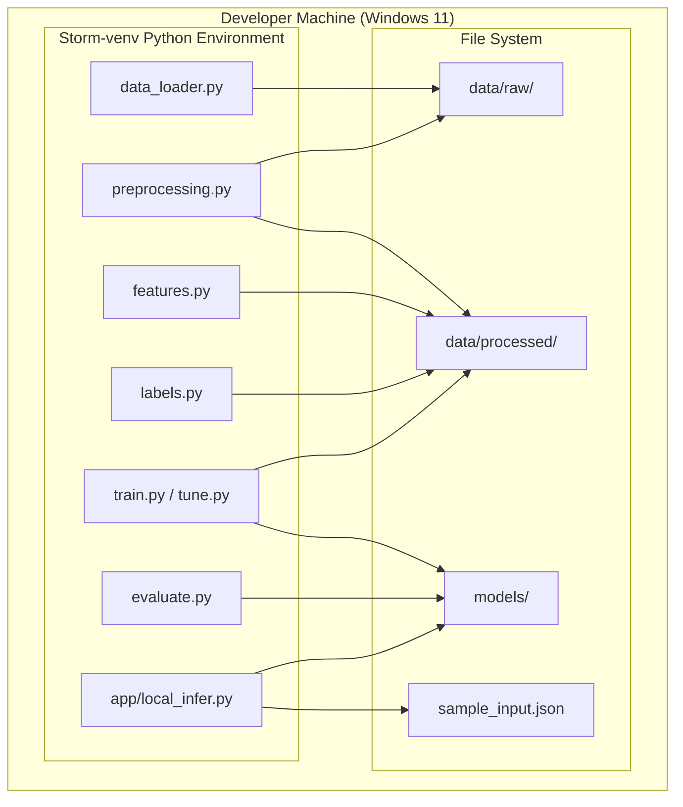

### Planned Phase 2: ESP32 Integration

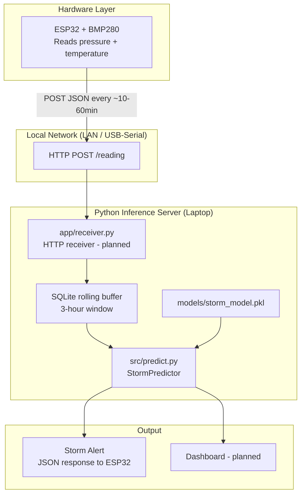

### Planned Phase 3: MQTT Streaming

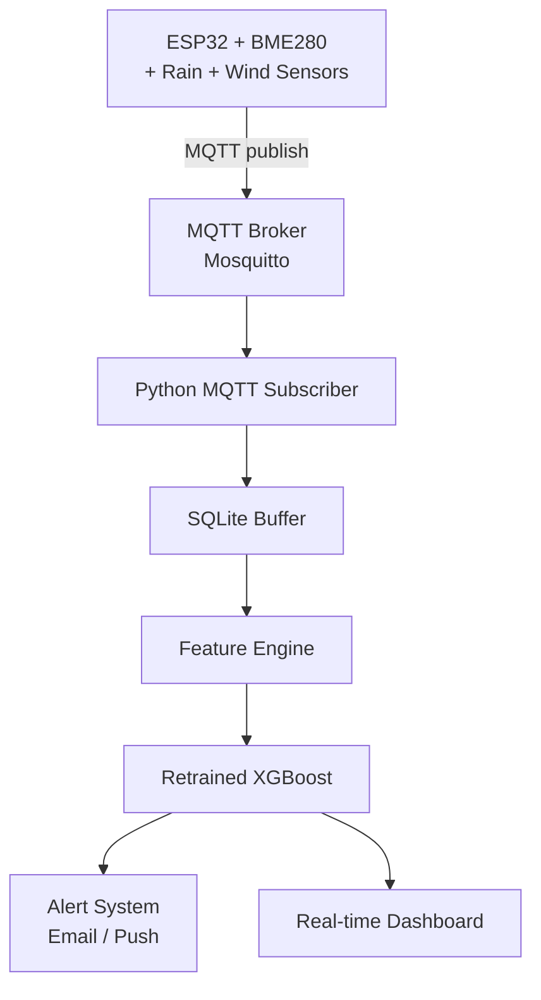

---

## 15. Key End-to-End Flows

### Flow 1: Full Training Pipeline (Phase 1)

**Trigger**: Developer runs full pipeline from CLI  
**Steps**:

1. `data_loader.py` — generate 17,520-row synthetic dataset with injected storm events → `data/raw/weather_raw.csv`
2. `preprocessing.py` — sort, clip, resample, forward-fill → `data/processed/weather_clean.csv`
3. `features.py` — compute 16 features for each row → `data/processed/weather_features.csv`
4. `labels.py` — apply pressure-drop rule; label each row → `data/processed/weather_labeled.csv` (with `label` column)
5. `tune.py` (or `train.py`) — time-aware split (80/20), grid search 1,296 XGBoost configs, select best by recall+F1 → `models/storm_model.pkl` + `models/model_metadata.json`
6. `evaluate.py` — load saved model, evaluate on val set, print metrics

**Involved Files**: All of `src/`, `data/`, `models/`  
**Database Tables**: None (CSV files as stages)  
**Output/Result**: Serialized XGBoost model + metadata JSON with metrics

### Flow 2: Local JSON Inference

**Trigger**: Developer runs `app/local_infer.py` with a JSON file

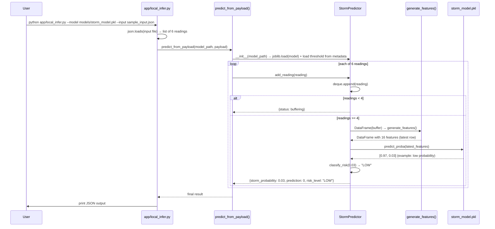

**Involved Files**: `app/local_infer.py`, `src/predict.py`, `src/features.py`, `src/constants.py`, `models/storm_model.pkl`, `models/model_metadata.json`  
**Output**: `{"storm_probability": N, "prediction": 0|1, "risk_level": "LOW|MEDIUM|HIGH", "decision_threshold": 0.7}`

### Flow 3: Hyperparameter Tuning

**Trigger**: Developer runs `src/tune.py` to improve model performance

1. Load `weather_labeled.csv`, drop NaN feature/label rows
2. Apply `resolve_time_split()` → 14,011 train rows / 3,503 val rows
3. Compute `scale_pos_weight ≈ 95.6` from class distribution
4. Iterate 1,296 parameter combinations using `itertools.product`
5. For each: fit XGBoost, compute probabilities on val, call `select_decision_threshold()` and `evaluate_model()`
6. Score by `(meets_recall_target, f1, precision, pr_auc, recall)` — pick max
7. Save best model via `joblib.dump()`, write updated `model_metadata.json` with `"tuned": true`

**Current best metrics**: Precision 0.571, Recall 0.154, F1 0.242, ROC-AUC 0.875  
**Duration**: 1,296 full model fits — can take 10–30 minutes on laptop hardware

### Flow 4: Pressure-Drop Label Creation (Core Business Logic)

**Trigger**: `labels.py` processes the feature CSV

For each row `i`:
1. Collect rows `i+1`, `i+2`, `i+3` pressure values (via `shift(-1)`, `shift(-2)`, `shift(-3)`)
2. Compute `future_min = min(those 3 values)`
3. Compute `drop = pressure[i] - future_min`
4. If `drop > 3.0 hPa`: `label[i] = 1`
5. Set `label[-3:]` = `pd.NA` (no future to look at)

**Meteorological interpretation**: A drop of more than 3 hPa in 3 hours is the classical barometric storm warning threshold used in operational meteorology.

---

## 16. Risks, Gaps, and Improvement Opportunities

### Immediate Improvements

| Issue | Severity | Fix |
|-------|----------|-----|
| **Recall = 15% vs. 80% target** | Critical | Lower decision threshold further; use SMOTE; try recall-optimized loss (focal loss, custom XGBoost objective) |
| **`config.yaml` not read by any module** | High | Either delete it (it's misleading) or wire it into each module as a config loader |
| **No input validation in `StormPredictor.add_reading()`** | High | Add a validation function checking required keys and numeric types before appending to buffer |
| **Missing unit tests for `preprocess_data()`** | Medium | Add tests for: clip bounds, duplicate removal, gap filling, frequency resampling |
| **Unpinned dependencies in `requirements.txt`** | Medium | Add version pins (`pandas>=2.0`, `xgboost>=2.0`) for reproducibility |
| **`config.yaml` has `decision_threshold: 0.5` but runtime uses `0.7`** | Low | Sync config values with actual training outputs or remove the inference section from config |

### Medium-Term Improvements

| Issue | Severity | Recommendation |
|-------|----------|----------------|
| **No cross-validation in tuning** | High | Use `TimeSeriesSplit` from scikit-learn for time-aware k-fold; reduces overfitting to a single split |
| **Synthetic training data only** | High | Wire NOAA StormEvents CSVs into training; create a mapping from storm event timestamps to weather sensor data |
| **No structured logging** | Medium | Add Python `logging` module; write timestamped logs to `logs/pipeline.log` |
| **Grid search is O(N) sequential** | Medium | Parallelize with `joblib.Parallel(n_jobs=-1)` — drop-in for the combination loop |
| **`StormPredictor` buffer lost on restart** | Medium | Persist buffer to SQLite or pickle; reload on startup for Phase 2 continuity |
| **No Makefile or task runner** | Low | Add a `Makefile` or `just` (justfile) with targets: `make train`, `make tune`, `make evaluate`, `make infer` |

### Long-Term Architecture Evolution

| Area | Current State | Target State |
|------|---------------|--------------|
| **Data transport** | CSV files between stages | Streaming pipeline (MQTT / Redis Streams) in Phase 3 |
| **Model versioning** | Manual `.pkl` files with date suffixes | MLflow or DVC for experiment tracking, model registry |
| **Inference serving** | Local Python script | FastAPI or Flask HTTP server with `/predict` endpoint |
| **Monitoring** | None | Prediction drift monitoring; alert if storm miss rate exceeds threshold |
| **Retraining** | Manual | Automated retraining pipeline triggered by new labeled data accumulation |
| **Hardware integration** | None (Phase 2 planned) | ESP32 + BMP280 → HTTP → Python server → prediction → LED/buzzer alert |
| **Multi-sensor support** | Pressure + temperature only | Phase 3: BME280 (+ humidity) + rain sensor + anemometer |
| **Feature expansion** | 16 features | Add humidity features, wind features, barometric tendency rate-of-change |
| **Deployment** | Local laptop only | Docker container for inference server; compose with MQTT broker |

### Security Considerations

- Phase 2 HTTP endpoint must not be exposed on `0.0.0.0` without authentication
- Sensor input clipping (`clip(900–1100 hPa, -60–60°C)`) should be enforced at API ingestion boundary, not just in preprocessing
- Model artifacts (`.pkl`) should be checked for integrity before loading; `joblib.load()` can execute arbitrary code if the file is tampered with

---

## 17. Developer Onboarding Guide

### How to Understand the Codebase Quickly

**Start here** (15-minute read):
1. [README.md](README.md) — quick start commands
2. [docs/storm-predection.md](docs/storm-predection.md) — full system design and rationale (most important doc)
3. [src/constants.py](src/constants.py) — the 16 features and thresholds are the shared contract

**Then read these files in order**:
4. [src/data_loader.py](src/data_loader.py) — understand the data shape
5. [src/features.py](src/features.py) — understand the feature engineering
6. [src/labels.py](src/labels.py) — understand what is being predicted
7. [src/predict.py](src/predict.py) — understand the inference interface

**Reference when needed**:
- [src/train.py](src/train.py) — training logic
- [src/evaluate.py](src/evaluate.py) — metrics and threshold selection
- [src/tune.py](src/tune.py) — grid search (only run when improving the model)

### Critical Files

| File | Why Critical |
|------|--------------|
| [src/constants.py](src/constants.py) | Single source of truth for feature names — never modify without updating all dependents |
| [models/model_metadata.json](models/model_metadata.json) | Defines the active decision threshold (0.7) — inference uses this at runtime |
| [src/predict.py](src/predict.py) | Core inference interface; all Phase 2 integration points through `StormPredictor` |
| [src/labels.py](src/labels.py) | Label definition encodes the ML problem — the 3.0 hPa threshold is a key tuning knob |
| [docs/storm-predection.md](docs/storm-predection.md) | Architecture decisions and future roadmap — read before making structural changes |

### Common Workflows

**Retrain the model on new data:**
```powershell
# 1. Place new CSV at data/raw/weather_raw.csv with columns: timestamp, pressure_hPa, temperature_C
# 2. Run pipeline stages 2–5:
.\Storm-venv\Scripts\python.exe src\preprocessing.py --input data\raw\weather_raw.csv --output data\processed\weather_clean.csv
.\Storm-venv\Scripts\python.exe src\features.py --input data\processed\weather_clean.csv --output data\processed\weather_features.csv
.\Storm-venv\Scripts\python.exe src\labels.py --input data\processed\weather_features.csv --output data\processed\weather_labeled.csv
.\Storm-venv\Scripts\python.exe src\tune.py --data data\processed\weather_labeled.csv --output models\storm_model.pkl
```

**Run inference on new readings:**
```powershell
# Create readings.json with at least 4 entries: [{timestamp, pressure_hPa, temperature_C}, ...]
.\Storm-venv\Scripts\python.exe app\local_infer.py --model models\storm_model.pkl --input readings.json
```

**Run tests:**
```powershell
.\Storm-venv\Scripts\python.exe -m pytest tests/ -v
# or:
.\Storm-venv\Scripts\python.exe -m unittest discover tests
```

**Add a new feature:**
1. Add the feature computation to `src/features.py` → `generate_features()`
2. Add the feature name to `FEATURE_COLS` in `src/constants.py`
3. Retrain the model (old `.pkl` will be incompatible with new feature list)
4. Update `tests/test_features.py` to assert the new column exists

### How to Run the System

**First time setup:**
```powershell
# 1. Create and activate venv (already exists as Storm-venv/)
.\Storm-venv\Scripts\Activate.ps1

# 2. Install dependencies
pip install -r requirements.txt

# 3. Generate synthetic training data
python src/data_loader.py --source synthetic --output data/raw/weather_raw.csv --periods 17520
```

**To train from scratch:**
```powershell
python src/preprocessing.py --input data/raw/weather_raw.csv --output data/processed/weather_clean.csv
python src/features.py --input data/processed/weather_clean.csv --output data/processed/weather_features.csv
python src/labels.py --input data/processed/weather_features.csv --output data/processed/weather_labeled.csv
python src/train.py --data data/processed/weather_labeled.csv --output models/storm_model.pkl
python src/evaluate.py --model models/storm_model.pkl --data data/processed/weather_labeled.csv --metadata models/model_metadata.json
```

**To test inference:**
```powershell
python app/local_infer.py --model models/storm_model.pkl --input sample_input.json
```

### How to Debug

1. **Model gives unexpected predictions**: Check `model_metadata.json` → look at `decision_threshold` and `scale_pos_weight`. If threshold is very high (≥ 0.7), most inputs will predict 0.
2. **`generate_features()` returns NaN for all features**: Check that input DataFrame has at least 4 rows (lag-3 features need 4 rows minimum).
3. **`StormPredictor` always returns `"buffering"`**: The buffer needs at least 4 readings. The `sample_input.json` has 6 readings, which is sufficient.
4. **Training fails with "Need at least 20 labeled rows"**: The labeled CSV has fewer valid rows than needed — check for excessive NaN rows or too few storm events in synthetic data.
5. **Feature mismatch error at inference**: The model was trained with one version of `FEATURE_COLS` and inference is using another. Always retrain after changing `constants.py`.

### What to Be Careful With Before Changing Code

1. **Do not change `FEATURE_COLS` in `constants.py`** without retraining the model. The saved `.pkl` model expects exactly these 16 features in this exact order.
2. **Do not change the label threshold** in `labels.py` (3.0 hPa) without understanding the impact on class distribution — the `scale_pos_weight` in training is computed from the labeled distribution.
3. **Do not introduce `random_state`-independent randomness** in features or labels — this breaks temporal ordering guarantees.
4. **Do not use `train_test_split` from scikit-learn** — the project explicitly forbids random splits to prevent data leakage in time-series.
5. **The tuning process takes a long time** (10–30 min for 1,296 candidates) — do not run it on every code change; use `train.py` for quick iteration.
6. **`storm_model_default.pkl` and `storm_model_v1.pkl`** are backup models — do not delete them. They are 81 KB vs. the tuned model's 53 KB (fewer trees, shallower depth).
7. **NOAA StormEvents CSVs** in `data/` are not currently used in training. They cover 1950–2020 and require significant preprocessing to be usable as training labels.

---

*Blueprint generated from full source code analysis on 2026-04-11.*  
*All metrics, file sizes, and configuration values are extracted directly from the codebase.*  
*Planned Phase 2/3 components are clearly marked as planned/inferred.*
